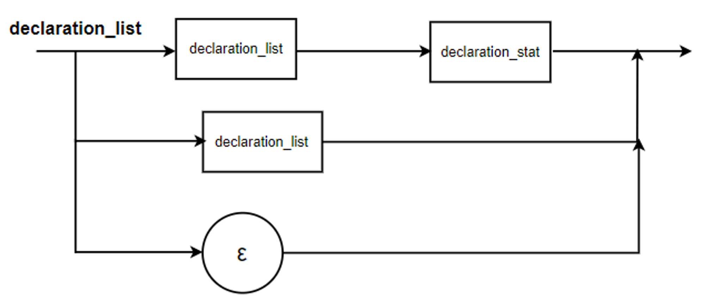
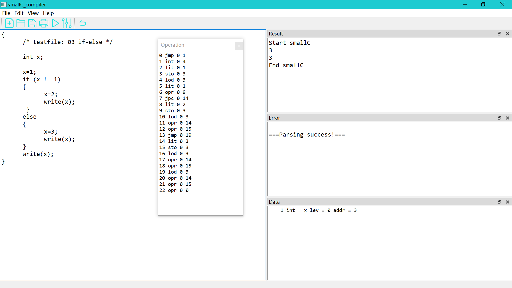

# smallC-programming-language-compiler 设计说明书

## 1 介绍

本文档主要介绍了`smallC`语言的语法定义及编译器设计相关信息。

本编译器对`smallC` (扩展后的)语言能够完成词法分析、语法分析、简单的出错处理、代码生成和解释程序。

实现了的扩展点有：跳过行注释，支持求余、判断奇偶、自增自减运算符，支持break、for、repeat、do-while语句，支持常量的定义与使用，支持目标指令单步执行，并查看运行时数据栈变化的功能。

## 2 编译器系统结构

### 2.1 编译器

#### 2.1.1 smallC语言（含扩展点）定义及其语法图

- `<program>∷={<declaration_list><statement_list>}`

  

- `<declaration_list>∷= <declaration_list><declaration_stat>|<declaration_list>|ε`

  

- `<declaration_stat>∷=int ID{,ID}|const ID = NUM{,ID = NUM};`

  

- `<statement_list>∷=<statement_list>|<statement>|ε`

  

- `<statement>∷=<if_stat>|<while_stat>|<for_stat>|<repeat_stat>|<dowhile_stat>|<read_stat>|<write_stat>|<compound_stat>|<expression_stat>`

  

- `<if_stat>∷=if (<expression>) <statement> [else <statement>]`

  

- `<while_stat>∷=while (<expression>) <statement>`

  

- `<for_stat>: : =for(<expression>;<bool_expr>;<expression>)< statement>`

  

- `<repeat_stat>: : =repeat<statement>until(<expression>);`

  

- `<dowhile_stat>: : =do<statement>while(<expression>);`

  

- `<write_stat>∷=write (<expression>);`

  

- `<read_stat>∷=read (ID[,ID]);`

  

- `<compound_stat>∷={<statement_list>}`

  

- `<expression_stat>∷=<expression>;|;`

  

- `<expression>∷=ID(=<bool_expr>|++|--)|<bool_expr>`

  

- `<bool_expr>∷=<additive_expr>|odd<additive_expr>|<additive_expr>(>|<|>=|<=|==|!=)<additive_expr>`

  

- `<additive_expr>∷=< term>{(+|-|XOR)< term>}`

  

- `<term>∷=<factor>{(*|/|%)< factor>}`

  

- `<factor>∷=(<expression>)|ID|NUM`

  

- `<break_stat>::=break;`

  

#### 2.1.2 判断是否符合两条限制规则

> 两条限制规则：
>
> 1. 图中每个分支点，分支的选择惟一由下一个读入符号确定。换句话说，不允许有两个分支都以相同的符号开始
> 2. 一种图形结构如果无需读入一个符号就可以贯通，我们称这种图形结构是“透明”的。对于一个透明的图形结构，必须能惟一确定下一个读入符号属于该图形或者属于该图形的跟随符号。换句话说，透明结构的始端符号集合与可能的所有跟随符号集合必须成相异关系

验证一组语法图是否符合两条限制规则的具体做法是：

1. 找出图中每一个分支点，考察每个分支点的各个分支的头符号是否相异 
2. 找出图中每一个透明结构，考察每个透明结构的头符号集合与其跟随符号集合是否相异 通常称满足两条语法限制规则的一组语法图为确定的图系统。 通过检查，符合上述两条限制规则。

#### 2.1.3 过程调用相关图

- 完整Qt项目引用include关系图

  

- smallC编译器函数调用关系图

  

#### 2.1.4 程序总体结构

```C
void compile_main();

void error(int n);
void getsym();
void getch();
void init();
void gen(enum fct x, int y, int z);
void test(bool* s1, bool* s2, int n);
int inset(int e, bool* s);
int addset(bool* sr, bool* s1, bool* s2, int n);
int subset(bool* sr, bool* s1, bool* s2, int n);
int mulset(bool* sr, bool* s1, bool* s2, int n);
void block(int lev, int tx, bool* fsys);
void interpret();
void factor(bool* fsys, int* ptx, int lev);
void term(bool* fsys, int* ptx, int lev);
void condition(bool* fsys, int* ptx, int lev);
void expression(bool* fsys, int* ptx, int lev);
void statement(bool* fsys, int* ptx, int lev);
void listall();
void vardeclaration(int* ptx, int lev, int* pdx);
void constdeclaration(int* ptx, int lev, int* pdx);
int position(char* idt, int tx);
void enter(enum object k, int* ptx, int lev, int* pdx);
int base(int l, int* s, int b);
```

#### 2.1.5 语法出错表定义

| 错误号 |             错误原因              |
| :----: | :-------------------------------: |
|   2    |       “=”之后必须跟随一个数       |
|   3    |         这里必须是一个“=”         |
|   4    |       这里必须是一个标识符        |
|   5    |      丢了一个分号（或逗号）       |
|   7    |         这里等待一条语句          |
|   8    | block语句部分之后出现的不正确符号 |
|   11   |         该标识符没有说明          |
|   12   | 给常数和过程标识符赋值是不允许的  |
|   17   |            这里等待“}”            |
|   19   |  该语句跟着一个不正确的使用符号   |
|   20   |      这里等待一个关系运算符       |
|   22   |           丢了右括号”)”           |
|   23   |           丢了左括号”(”           |
|   24   |      表达式不能以此符号开始       |
|   30   |         常量位数超过14位          |
|  301   |              数越界               |
|   32   |              缺少“{”              |
|   33   |           嵌套层数太多            |
|   35   |  read语句中应该读入声明过的变量   |
|   66   |             缺少until             |
|   77   |          这里应该是while          |

### 2.2 虚拟机

#### 2.2.1 虚拟机组织结构

由2个存储器、1个指令寄存器和3个地址寄存器组成。

程序存储器code用来存放通过编译产生的中间代码程序（目标程序），它在程序解释执行过程中保持不变。数据存储器s被当成数据栈（sack）使用。所有的算术和关系操作符都从栈顶找到它的操作数，又以计算结果取而代之。栈顶数据单元的地址用地址寄存器t（top）标记。

数据存储器s只有在代码程序被解释执行时才开始使用。指令寄存器i含有正在解释的指令。程序地址寄存器p含有下一条要从程序存储器取得的、被解释执行指令的地址。 如下图所示：


#### 2.2.2 虚拟机指令格式

```C
/* 虚拟机代码结构 */
struct instruction
{
    enum fct f; /* 虚拟机代码指令 */
    int l;      /* 引用层与声明层的层次差 */
    int a;      /* 根据f的不同而不同 */
};
```

#### 2.2.3 虚拟机指令系统及其解释

```C
/* 虚拟机代码指令 */ 
enum fct {
    lit, opr, lod,
    sto, cal, ini,
    jmp, jpc,
};
```

## 3 模块架构


## 4 模块功能介绍

### 4.1 词法分析

主要由`getsym`函数完成。调用`getch`过滤空格，行注释与块注释，读取一个字符，通过分析获取的符号来判断是保留字，标识符，符号，数字还是其他。

### 4.2 语法分析

判断所识别的符号是否符合语法规则，如不符合则生成错误标号。

### 4.3 中间代码生成

根据语法分析的结果生成相应可解释执行的虚拟机代码。

### 4.4 解释执行

通过读取虚拟机代码，执行堆栈的操作模拟程序的实际运行来输出相应结果。

### 4.5 出错处理

读取错误标号，用相应数目的空格输出来表示错误出现的位置。

### 4.6 表格管理

根据定义的是整数变量还是常量来记录其存储地址，相应地址等相关信息

## 5 模块接口

### 5.1 词法分析

直接调用getsym()函数即可，无需其他参数，符号保存在变量sym中

### 5.2 语法分析

初始状态时, tx=0, lev=0, fsys包含程序所有可能的开始符号集合

```C
/* 编译程序主体 */
/*
 * lev:    当前分程序所在层
 * tx:     符号表当前尾指针
 * fsys:   当前模块后继符号集合——FOLLOW集
 */
void block(int lev, int tx, bool* fsys)
{
    int i;
    int dx;                 /* 记录数据分配的相对地址 */
    int tx0;                /* 保留初始tx */
    int cx0;                /* 保留初始cx */
    bool nxtlev[symnum];    /* 在下级函数的参数中，符号集合均为值参，但由于使用数组实现，
                               传递进来的是指针，为防止下级函数改变上级函数的集合，开辟新的空间
                               传递给下级函数*/

    dx = 3;                 /* 三个空间用于存放静态链SL、动态链DL和返回地址RA  */
    tx0 = tx;		        /* 记录本层标识符的初始位置 */
    table[tx].adr = cx;	    /* 记录当前层代码的开始位置 */
    gen(jmp, 0, 0);         /* 产生跳转指令，跳转位置未知暂时填0 */

    if (lev > levmax)		/* 嵌套层数过多 */
    {
        error(33);
    }

    getsym();

    if (sym != beginsym)
    {
        error(32);
    }

    getsym();

    flagdepth = -1;
    flagcon = false;
    flagfor = false;

    if (sym == constsym || sym == varsym)
    {
        do {

            if (sym == constsym)	/* 遇到常量声明符号，开始处理常量声明 */
            {
                getsym();

                do {
                    constdeclaration(&tx, lev, &dx);	/* dx的值会被constdeclaration改变，使用指针 */
                    while (sym == comma)  /* 遇到逗号继续定义常量 */
                    {
                        getsym();
                        constdeclaration(&tx, lev, &dx);
                    }
                    if (sym == semicolon) /* 遇到分号结束定义常量 */
                    {
                        getsym();
                    }
                    else
                    {
                        error(5);   /* 漏掉了分号 */
                    }
                } while (sym  == ident);
            }

            if (sym == varsym)		/* 遇到变量声明符号，开始处理变量声明 */
            {
                getsym();

                do {
                    vardeclaration(&tx, lev, &dx);
                    while (sym == comma)
                    {
                        getsym();
                        vardeclaration(&tx, lev, &dx);
                    }
                    /*if (sym == semicolon)
                    {
                        getsym();
                    }
                    else*/
                    if (sym != semicolon)
                    {
                        error(5); /* 漏掉了分号 */
                    }
                } while (sym == ident);
            }

            //while (sym == procsym) /* 遇到过程声明符号，开始处理过程声明 */
            //{
            //	getsym();
            //	if (sym == ident)
            //	{
            //		enter(procedure, &tx, lev, &dx);	/* 填写符号表 */
            //		getsym();
            //	}
            //	else
            //	{
            //		error(4);	/* procedure后应为标识符 */
            //	}
            //	if (sym == semicolon)
            //	{
            //		getsym();
            //	}
            //	else
            //	{
            //		error(5);	/* 漏掉了分号 */
            //	}
            //	memcpy(nxtlev, fsys, sizeof(bool) * symnum);
            //	nxtlev[semicolon] = true;
            //	block(lev + 1, tx, nxtlev); /* 递归调用 */
            //	if (sym == semicolon)
            //	{
            //		getsym();
            //		memcpy(nxtlev, statbegsys, sizeof(bool) * symnum);
            //		nxtlev[ident] = true;
            //		nxtlev[procsym] = true;
            //		test(nxtlev, fsys, 6);
            //	}
            //	else
            //	{
            //		error(5);	/* 漏掉了分号 */
            //	}
            //}
            memcpy(nxtlev, statbegsys, sizeof(bool) * symnum);
            nxtlev[ident] = true;
            nxtlev[semicolon] = true;
            nxtlev[endsym] = true;
            test(nxtlev, declbegsys, 7);
        } while (inset(sym, declbegsys));	/* 直到没有声明符号 */
    }

    //getsym();

    code[table[tx0].adr].a = cx;	/* 把前面生成的跳转语句的跳转位置改成当前位置 */ //!!!
    table[tx0].adr = cx;	        /* 记录当前过程代码地址 */
    table[tx0].size = dx;	        /* 声明部分中每增加一条声明都会给dx增加1，声明部分已经结束，dx就是当前过程数据的size */
    cx0 = cx;
    gen(ini, 0, dx);	            /* 生成指令，此指令执行时在数据栈中为被调用的过程开辟dx个单元的数据区 */

    for (i = 1; i <= tx; i++)
    {
        switch (table[i].kind)
        {
            case constant:
                datastring += "    " + QString::number(i) + " const " + table[i].name;
                datastring += " val = " + QString::number(table[i].val) + "\n";
                break;
            case variable:
                datastring += "    " + QString::number(i) + " int   " + table[i].name;
                datastring += " lev = " + QString::number(table[i].level)
                        + " addr = " + QString::number(table[i].adr) + "\n";
                break;
            //case procedure:
            //	printf("    %d proc  %s ", i, table[i].name);
            //	printf("lev=%d addr=%d size=%d\n", table[i].level, table[i].adr, table[i].size);
            //	fprintf(ftable, "    %d proc  %s ", i, table[i].name);
            //	fprintf(ftable, "lev=%d addr=%d size=%d\n", table[i].level, table[i].adr, table[i].size);
            //	break;
        }
    }
    datastring += "\n";

    /* 语句后继符号为end */
    memcpy(nxtlev, fsys, sizeof(bool) * symnum);	/* 每个后继符号集合都包含上层后继符号集合，以便补救 */
    nxtlev[endsym] = true;
    nxtlev[elsesym] = true;
    nxtlev[semicolon] = true;
    nxtlev[rparen] = true;
    nxtlev[untilsym] = true;
    nxtlev[whilesym] = true;
    nxtlev[breaksym] = true;

    sym = beginsym;

    breakinit();

    statement(nxtlev, &tx, lev);
    gen(opr, 0, 0);	                    /* 每个过程出口都要使用的释放数据段指令 */
    memset(nxtlev, 0, sizeof(bool) * symnum);	/* 分程序没有补救集合 */
    test(fsys, nxtlev, 8);            	/* 检测后继符号正确性 */
}
```


### 5.3 中间代码生成

根据所要执行的操作参照指令系统输入相应的f表明操作类型，及l多表示层数, a多用于传参

```C
/* 生成虚拟机代码 */
/*
 * x: instruction.f;
 * y: instruction.l;
 * z: instruction.a;
 */
void gen(enum fct x, int y, int z)
{
    if (cx >= cxmax)
    {
        operationstring = "Program is too long!\n"; /* 生成的虚拟机代码程序过长 */
        //exit(1);
    }
    if (z >= amax)
    {
        operationstring = "Displacement address is too big!\n"; /* 地址偏移越界 */
        //exit(1);
    }
    code[cx].f = x;
    code[cx].l = y;
    code[cx].a = z;
    cx++; //!!!cx指的是空位！
}
```

### 5.4 解释执行

对已经转为中间代码的code存储器，调用interpret()进行解释执行

```C
/* 解释程序 */
void interpret()
{
    int p = 0; /* 指令指针 */
    int b = 1; /* 指令基址 */
    int t = 0; /* 栈顶指针 */
    struct instruction i;	/* 存放当前指令 */
    int s[stacksize];	/* 栈 */

    stackstring = "";
    resultstring += "Start smallC\n";

    s[0] = 0; /* s[0]不用 */
    s[1] = 0; /* 主程序的三个联系单元均置为0 */
    s[2] = 0;
    s[3] = 0;
    do {
        i = code[p];	/* 读当前指令 */
        p = p + 1;
        switch (i.f)
        {
            case lit:	/* 将常量a的值取到栈顶 */
                t = t + 1;
                s[t] = i.a;
                break;
            case opr:	/* 数学、逻辑运算 */
                switch (i.a)
                {
                    case 0:  /* 函数调用结束后返回 */
                        t = b - 1;
                        p = s[t + 3];
                        b = s[t + 2];
                        break;
                    case 1: /* 栈顶元素取反 */
                        s[t] = -s[t];
                        break;
                    case 2: /* 次栈顶项加上栈顶项，退两个栈元素，相加值进栈 */
                        t = t - 1;
                        s[t] = s[t] + s[t + 1];
                        break;
                    case 3:/* 次栈顶项减去栈顶项 */
                        t = t - 1;
                        s[t] = s[t] - s[t + 1];
                        break;
                    case 4:/* 次栈顶项乘以栈顶项 */
                        t = t - 1;
                        s[t] = s[t] * s[t + 1];
                        break;
                    case 5:/* 次栈顶项除以栈顶项 */
                        t = t - 1;
                        s[t] = s[t] / s[t + 1];
                        break;
                    case 6:/* 次栈顶项对栈顶项取余 */
                        t = t - 1;
                        s[t] = s[t] % s[t + 1];
                        break;
                    case 7:/* 栈顶元素的奇偶判断 */
                        s[t] = s[t] % 2;
                        break;
                    case 8:/* 次栈顶项与栈顶项是否相等 */
                        t = t - 1;
                        s[t] = (s[t] == s[t + 1]);
                        break;
                    case 9:/* 次栈顶项与栈顶项是否不等 */
                        t = t - 1;
                        s[t] = (s[t] != s[t + 1]);
                        break;
                    case 10:/* 次栈顶项是否小于栈顶项 */
                        t = t - 1;
                        s[t] = (s[t] < s[t + 1]);
                        break;
                    case 11:/* 次栈顶项是否大于等于栈顶项 */
                        t = t - 1;
                        s[t] = (s[t] >= s[t + 1]);
                        break;
                    case 12:/* 次栈顶项是否大于栈顶项 */
                        t = t - 1;
                        s[t] = (s[t] > s[t + 1]);
                        break;
                    case 13: /* 次栈顶项是否小于等于栈顶项 */
                        t = t - 1;
                        s[t] = (s[t] <= s[t + 1]);
                        break;
                    case 14:/* 栈顶值输出 */
                        resultstring += QString::number(s[t]);
                        t = t - 1;
                        break;
                    case 15:/* 输出换行符 */
                        resultstring += "\n";
                        break;
                    case 16:/* 读入一个输入置于栈顶 */
                        resultstring += dataname[inpoint] + ":";
                        t = t + 1;
                        s[t] = input();
                        inpoint++;
                        resultstring += QString::number(s[t]) + "\n";
                        break;
                    case 17:/* 次栈顶项与栈顶项做异或运算 */
                        t = t - 1;
                        s[t] = s[t] ^ s[t + 1];
                        break;
                }
            break;
            case lod:	/* 取相对当前过程的数据基地址为a的内存的值到栈顶 */
                t = t + 1;
                s[t] = s[base(i.l, s, b) + i.a];
                break;
            case sto:	/* 栈顶的值存到相对当前过程的数据基地址为a的内存 */
                s[base(i.l, s, b) + i.a] = s[t];
                t = t - 1;
                break;
            case cal:	/* 调用子过程 */
                s[t + 1] = base(i.l, s, b);	/* 将父过程基地址入栈，即建立静态链 */
                s[t + 2] = b;	/* 将本过程基地址入栈，即建立动态链 */
                s[t + 3] = p;	/* 将当前指令指针入栈，即保存返回地址 */
                b = t + 1;	/* 改变基地址指针值为新过程的基地址 */
                p = i.a;	/* 跳转 */
                break;
            case ini:	/* 在数据栈中为被调用的过程开辟a个单元的数据区 */
                t = t + i.a;
                break;
            case jmp:	/* 直接跳转 */
                p = i.a;
                break;
            case jpc:	/* 条件跳转 */
                if (s[t] == 0)
                    p = i.a;
                t = t - 1;
                break;
        }
    } while (p != 0);

    for (int i=0;i<t;i++)
    {
        stackstring += QString::number(i) + " " + QString::number(s[i]) + "\n";
    }
    resultstring += "End smallC\n";
}
```

| opr a |     说明      |
| :---: | :-----------: |
|   1   |    取负，-    |
|   2   |    相加，+    |
|   3   |    相减，-    |
|   4   |    相乘，*    |
|   5   |   相除，div   |
|   6   |    取余，%    |
|   7   |  判奇偶，odd  |
|   8   |   判相等，=   |
|   9   |  判不等，<>   |
|  10   |   判小于，<   |
|  11   | 判大于等于，≥ |
|  12   |   判大于，>   |
|  13   | 判小于等于，≤ |
|  14   |     输出      |
|  15   |  输出换行符   |
|  16   |     输入      |
|  17   |     异或      |

### 5.5 出错处理

在出错的地方调用此函数过程，并传入错误标号

```C
/* 出错处理，打印出错位置和错误编码 */
void error(int n)
{
    char space[81];
    memset(space, 32, 81);

    space[cc - 1] = 0; /* 出错时当前符号已经读完，所以cc-1 */

    errorstring += "++++++++here has error: " + QString::number(n) + "++++++++\n";

    err = err + 1;
}
```

### 5.6 表格管理

在表格中加入信息时，传递标识符种类，符号表尾指针，当前分配的变量相对地址及其所在层次，传递给过程enter()

```C
/* 初始化 */
void init()
{
    int i;

    /* 设置单字符符号 */
    for (i = 0; i <= 255; i++)
    {
        ssym[i] = nul;
    }
    ssym['+'] = plus;
    ssym['-'] = minus;
    ssym['*'] = times;
    ssym['/'] = slash;
    ssym['%'] = percent;
    ssym['('] = lparen;
    ssym[')'] = rparen;
    ssym[','] = comma;
    ssym[';'] = semicolon;
    ssym['{'] = beginsym;
    ssym['}'] = endsym;

    /* 设置保留字名字,按照字母顺序，便于二分查找 */
    strcpy(&(word[0][0]), "break");
    strcpy(&(word[1][0]), "call");
    strcpy(&(word[2][0]), "const");
    strcpy(&(word[3][0]), "continue");
    strcpy(&(word[4][0]), "do");
    strcpy(&(word[5][0]), "else");
    strcpy(&(word[6][0]), "exit");
    strcpy(&(word[7][0]), "for");
    strcpy(&(word[8][0]), "if");
    strcpy(&(word[9][0]), "int");
    strcpy(&(word[10][0]), "odd");
    strcpy(&(word[11][0]), "read");
    strcpy(&(word[12][0]), "repeat");
    strcpy(&(word[13][0]), "until");
    strcpy(&(word[14][0]), "while");
    strcpy(&(word[15][0]), "write");
    strcpy(&(word[16][0]), "xor");

    /* 设置保留字符号 */
    wsym[0] = breaksym;
    wsym[1] = callsym;
    wsym[2] = constsym;
    wsym[3] = continuesym;
    wsym[4] = dosym;
    wsym[5] = elsesym;
    wsym[6] = exitsym;
    wsym[7] = forsym;
    wsym[8] = ifsym;
    wsym[9] = varsym;
    wsym[10] = oddsym;
    wsym[11] = readsym;
    wsym[12] = repeatsym;
    wsym[13] = untilsym;
    wsym[14] = whilesym;
    wsym[15] = writesym;
    wsym[16] = xorsym;

    /* 设置指令名称 */
    strcpy(&(mnemonic[lit][0]), "lit");
    strcpy(&(mnemonic[opr][0]), "opr");
    strcpy(&(mnemonic[lod][0]), "lod");
    strcpy(&(mnemonic[sto][0]), "sto");
    strcpy(&(mnemonic[cal][0]), "cal");
    strcpy(&(mnemonic[ini][0]), "int");
    strcpy(&(mnemonic[jmp][0]), "jmp");
    strcpy(&(mnemonic[jpc][0]), "jpc");

    /* 设置符号集 */
    for (i = 0; i < symnum; i++)
    {
        declbegsys[i] = false;
        statbegsys[i] = false;
        facbegsys[i] = false;
    }

    /* 设置声明开始符号集 */
    declbegsys[constsym] = true;
    declbegsys[varsym] = true;
    //declbegsys[procsym] = true;

    /* 设置语句开始符号集 */
    statbegsys[beginsym] = true;
    statbegsys[callsym] = true;
    statbegsys[ifsym] = true;
    statbegsys[whilesym] = true;
    statbegsys[forsym] = true;
    statbegsys[repeatsym] = true;
    statbegsys[dosym] = true;
    statbegsys[ident] = true;
    statbegsys[readsym] = true;
    statbegsys[writesym] = true;
    statbegsys[breaksym] = true;

    /* 设置因子开始符号集 */
    facbegsys[ident] = true;
    facbegsys[number] = true;
    facbegsys[lparen] = true;
}
```

```C
/* 在符号表中加入一项 */
/*
 * k:      标识符的种类为const，var或procedure
 * ptx:    符号表尾指针的指针，为了可以改变符号表尾指针的值
 * lev:    标识符所在的层次
 * pdx:    dx为当前应分配的变量的相对地址，分配后要增加1
 *
 */
void enter(enum object k, int* ptx, int lev, int* pdx)
{
    (*ptx)++;
    strcpy(table[(*ptx)].name, id); /* 符号表的name域记录标识符的名字 */
    table[(*ptx)].kind = k;
    switch (k)
    {
        case constant:	/* 常量 */
            if (num > amax)
            {
                error(31);	/* 常数越界 */
                num = 0;
            }
            table[(*ptx)].val = num; /* 登记常数的值 */
            break;
        case variable:	/* 变量 */
            table[(*ptx)].level = lev;
            table[(*ptx)].adr = (*pdx);
            (*pdx)++;
            break;
    //case procedure:	/* 过程 */
    //	table[(*ptx)].level = lev;
    //	break;
    }
}
```


## 6 全局数据结构、常量和变量

```C
#include<stdio.h>
#include<stdlib.h>
#include<string.h>

#define bool int
#define true 1
#define false 0
#define norw 18       /* 保留字个数 */
#define txmax 100     /* 符号表容量 */
#define nmax 14       /* 数字的最大位数 */
#define al 11         /* 标识符的最大长度 */
#define maxerr 30     /* 允许的最多错误数 */
#define amax 2048     /* 地址上界*/
#define levmax 3      /* 最大允许过程嵌套声明层数*/
#define cxmax 200     /* 最多的虚拟机代码数 */
#define stacksize 500 /* 运行时数据栈元素最多为500个 */
#define brnum_max 50  /* break语句最大数量 */

 /* 符号 */
enum symbol {
    nul, ident, number, plus, minus, dplus, dminus, xorsym,
    times, slash, percent, oddsym, eql, neq,
    lss, leq, gtr, geq, lparen,
    rparen, comma, semicolon, becomes,
    beginsym, endsym, ifsym, elsesym,
    whilesym, forsym, dosym, repeatsym, untilsym,
    continuesym, exitsym, breaksym,
    writesym, readsym, callsym, constsym,
    varsym, procsym,
};
#define symnum 41

/* 符号表中的类型 */
enum object {
    constant,
    variable,
    //procedure,
};

/* 虚拟机代码指令 */ //!!!可以去掉cal
enum fct {
    lit, opr, lod,
    sto, cal, ini,
    jmp, jpc,
};
#define fctnum 8

/* 虚拟机代码结构 */
struct instruction
{
    enum fct f; /* 虚拟机代码指令 */
    int l;      /* 引用层与声明层的层次差 */
    int a;      /* 根据f的不同而不同 */
};

char ch;            /* 存放当前读取的字符，getch 使用 */
enum symbol sym;    /* 当前的符号 */
char id[al + 1];      /* 当前ident，多出的一个字节用于存放0 */
int num;            /* 当前number */
int cc, linenum;         /* getch使用的计数器，cc表示当前字符(ch)的位置 */
int cx;             /* 虚拟机代码指针, 取值范围[0, cxmax-1]*/
char a[al + 1];       /* 临时符号，多出的一个字节用于存放0 */
struct instruction code[cxmax]; /* 存放虚拟机代码的数组 */
char word[norw][al];        /* 保留字 */
enum symbol wsym[norw];     /* 保留字对应的符号值 */
enum symbol ssym[256];      /* 单字符的符号值 */
char mnemonic[fctnum][5];   /* 虚拟机代码指令名称 */
bool declbegsys[symnum];    /* 表示声明开始的符号集合 */
bool statbegsys[symnum];    /* 表示语句开始的符号集合 */
bool facbegsys[symnum];     /* 表示因子开始的符号集合 */
int flagdepth;   /* 记录"{}"嵌套层数 */
bool flagcon, flagfor, flagtop;
int cx_break[brnum_max];
int brnum; /* 表示当前break语句个数 */
enum symbol tsym;

/* 符号表结构 */
struct tablestruct //!!!size也用不到，level都是0因为只有主函数
{
    char name[al];	    /* 名字 */
    enum object kind;	/* 类型：const，var或procedure */
    int val;            /* 数值，仅const使用 */
    int level;          /* 所处层，仅const不使用 */
    int adr;            /* 地址，仅const不使用 */
    int size;           /* 需要分配的数据区空间, 仅procedure使用 */
};

struct tablestruct table[txmax]; /* 符号表 */

int err;        /* 错误计数器 */

QString codestring; /* 存放main window中代码 */
QStringList codestring_list;
QStringList oprstring_list;
QString tempstring; /* 临时字符串变量 */
QString resultstring;     /* 存放result信息 */
QString errorstring;      /* 存放error信息 */
QString operationstring;  /* 存放operation信息 */
QString datastring;       /* 存放data信息 */
QString stackstring;       /* 存放stack信息 */
QString linestring;
QString oprstring = "";
char* linecharlist;
QByteArray qba;
QString dataname[txmax];
int datapoint,inpoint,oprpoint=0;
bool oprflag = false;
int b; /* 指令基址 */
int t; /* 栈顶指针 */
struct instruction i;	/* 存放当前指令 */
int s[stacksize];	/* 栈 */
```

## 7 函数原型

| 函数原型 | void compile_main() |
| -------- | ------------------- |
| 参数描述 | —                   |
| 函数描述 | 主程序              |
| 返回值   | —                   |

| 函数原型 | void error(int n)                |
| -------- | -------------------------------- |
| 参数描述 | 错误编码n                        |
| 函数描述 | 出错处理，打印出错位置和错误编码 |
| 返回值   | —                                |

| 函数原型 | void getsym()          |
| -------- | ---------------------- |
| 参数描述 | —                      |
| 函数描述 | 词法分析，获取一个符号 |
| 返回值   | —                      |

| 函数原型 | void getch()                             |
| -------- | ---------------------------------------- |
| 参数描述 | —                                        |
| 函数描述 | 过滤空格，读取一个字符；被函数getsym调用 |
| 返回值   | —                                        |

| 函数原型 | void init() |
| -------- | ----------- |
| 参数描述 | —           |
| 函数描述 | 初始化      |
| 返回值   | —           |

| 函数原型 | void gen(enum fct x, int y, int z)                           |
| -------- | ------------------------------------------------------------ |
| 参数描述 | x: instruction.f虚拟机代码指令;y: instruction.l引用层与声明层的层次差; z: instruction.a根据f的不同而不同 |
| 函数描述 | 生成虚拟机代码                                               |
| 返回值   | —                                                            |

| 函数原型 | void test(bool* s1, bool* s2, int n)                         |
| -------- | ------------------------------------------------------------ |
| 参数描述 | s1:	需要的单词集合；s2:	如果不是需要的单词，在某一出错状态时，可恢复语法分析继续正常工作的补充单词符号集合；n:  	错误号 |
| 函数描述 | 测试当前符号是否合法：在语法分析程序的入口和出口处调用测试函数test，检查当前单词进入和退出该语法单位的合法性 |
| 返回值   | —                                                            |

| 函数原型 | int inset(int e, bool* s)     |
| -------- | ----------------------------- |
| 参数描述 | 字符编号 e, 字符编号集合数组s |
| 函数描述 | 用数组实现集合的包含运算      |
| 返回值   | 在则非0，不在则0              |

| 函数原型 | int addset(bool* sr, bool* s1, bool* s2, int n)              |
| -------- | ------------------------------------------------------------ |
| 参数描述 | 字符编号集合后的数组sr, 两个字符编号集合数组s1, s2, 集合元素数 |
| 函数描述 | 用数组实现集合的并集运算                                     |
| 返回值   | —                                                            |

| 函数原型 | int subset(bool* sr, bool* s1, bool* s2, int n)              |
| -------- | ------------------------------------------------------------ |
| 参数描述 | 字符编号集合后的数组sr, 两个字符编号集合数组s1, s2, 集合元素数 |
| 函数描述 | 用数组实现集合的差集运算                                     |
| 返回值   | —                                                            |

| 函数原型 | int mulset(bool* sr, bool* s1, bool* s2, int n)              |
| -------- | ------------------------------------------------------------ |
| 参数描述 | 字符编号集合后的数组sr, 两个字符编号集合数组s1, s2, 集合元素数 |
| 函数描述 | 用数组实现集合的交集运算                                     |
| 返回值   | —                                                            |

| 函数原型 | void block(int lev, int tx, bool* fsys)                      |
| -------- | ------------------------------------------------------------ |
| 参数描述 | lev:    当前分程序所在层；tx:     符号表当前尾指针；fsys:   当前模块后继符号集合——FOLLOW集 |
| 函数描述 | 编译程序主体                                                 |
| 返回值   | —                                                            |

| 函数原型 | void interpret() |
| -------- | ---------------- |
| 参数描述 | —                |
| 函数描述 | 解释程序         |
| 返回值   | —                |

| 函数原型 | void factor(bool* fsys, int* ptx, int lev)                   |
| -------- | ------------------------------------------------------------ |
| 参数描述 | fsys:当前模块后继符号集合；ptx:符号表当前尾指针；lev:当前分程序所在层 |
| 函数描述 | 因子处理                                                     |
| 返回值   | —                                                            |

| 函数原型 | void term(bool* fsys, int* ptx, int lev)                     |
| -------- | ------------------------------------------------------------ |
| 参数描述 | fsys:当前模块后继符号集合；ptx:符号表当前尾指针；lev:当前分程序所在层 |
| 函数描述 | 项处理                                                       |
| 返回值   | —                                                            |

| 函数原型 | void condition(bool* fsys, int* ptx, int lev)                |
| -------- | ------------------------------------------------------------ |
| 参数描述 | fsys:当前模块后继符号集合；ptx:符号表当前尾指针；lev:当前分程序所在层 |
| 函数描述 | 条件处理                                                     |
| 返回值   | —                                                            |

| 函数原型 | void expression(bool* fsys, int* ptx, int lev)               |
| -------- | ------------------------------------------------------------ |
| 参数描述 | fsys:当前模块后继符号集合；ptx:符号表当前尾指针；lev:当前分程序所在层 |
| 函数描述 | 表达式处理                                                   |
| 返回值   | —                                                            |

| 函数原型 | void statement(bool* fsys, int* ptx, int lev)                |
| -------- | ------------------------------------------------------------ |
| 参数描述 | fsys:当前模块后继符号集合；ptx:符号表当前尾指针；lev:当前分程序所在层 |
| 函数描述 | 语句处理                                                     |
| 返回值   | —                                                            |

| 函数原型 | void listall()   |
| -------- | ---------------- |
| 参数描述 | —                |
| 函数描述 | 输出所有目标代码 |
| 返回值   | —                |

| 函数原型 | void vardeclaration(int* ptx, int lev, int* pdx)             |
| -------- | ------------------------------------------------------------ |
| 参数描述 | ptx:符号表尾指针的指针，为了可以改变符号表尾指针的值；lev:标识符所在的层次；pdx:dx为当前应分配的变量的相对地址 |
| 函数描述 | 变量声明处理                                                 |
| 返回值   | —                                                            |

| 函数原型 | void constdeclaration(int* ptx, int lev, int* pdx)           |
| -------- | ------------------------------------------------------------ |
| 参数描述 | ptx:符号表尾指针的指针，为了可以改变符号表尾指针的值；lev:标识符所在的层次；pdx:dx为当前应分配的变量的相对地址 |
| 函数描述 | 常量声明处理                                                 |
| 返回值   | —                                                            |

| 函数原型 | int position(char* idt, int tx)                              |
| -------- | ------------------------------------------------------------ |
| 参数描述 | id:要查找的名字 tx:当前符号表尾指针                          |
| 函数描述 | 查找标识符在符号表中的位置，从tx开始倒序查找标识符找到则返回在符号表中的位置，否则返回0 |
| 返回值   | 标识符找到则返回在符号表中的位置或0                          |

| 函数原型 | void enter(enum object k, int* ptx, int lev, int* pdx)       |
| -------- | ------------------------------------------------------------ |
| 参数描述 | k:标识符的种类；ptx:符号表尾指针的指针，为了可以改变符号表尾指针的值；lev:标识符所在的层次；pdx:dx为当前应分配的变量的相对地址，分配后要增加1 |
| 函数描述 | 在符号表中加入一项                                           |
| 返回值   | —                                                            |

| 函数原型 | int base(int l, int* s, int b)             |
| -------- | ------------------------------------------ |
| 参数描述 | l: 上移的层数; s: 当前运行的栈; b:指令基址 |
| 函数描述 | 通过过程基址求上l层过程的基址              |
| 返回值   | —                                          |

| 函数原型 | void backbreak(int endaddr) |
| -------- | --------------------------- |
| 参数描述 | endaddr：返回地址           |
| 函数描述 | break语句地址回填           |
| 返回值   | —                           |


# smallC-programming-language-compiler 测试说明书

## 1 概述

### 1.1 测试描述

#### 1.1.1 界面结构


#### 1.1.2 功能介绍


### 1.2 测试环境

`Qt 5.15.2`


## 2 测试用例描述

### 2.1 测试一

#### 1. 测试目标

输出100以内所有的素数

#### 2. 测试源程序

```C
{
	/* testfile: 01 prime < 100 */

	int i,j,prime;

	for (i=2;i<=100;i++)
	{
		prime = 1;
		for (j=2;j<i;j++)
		{
			if (i % j == 0)
			{
				prime = 0;
				break;
			}
		}		
		if (prime == 1) write(i);
	}
}
```

#### 3. 测试步骤

点击`open file`键，打开测试文件`test_01_prime.txt`，点击`run`键

#### 4. 测试结果


### 2.2 测试二

#### 1. 测试目标

输出两个数的最小公倍数

#### 2. 测试源程序

```C
{
	/* testfile: 02 lcm */

	int m,n,x,y,temp,lcm,gcd;
	
	read(m,n);
	x = m;
	y = n;
	while(y)
	{
		temp = x % y;
		x = y;
		y = temp;
	}
	gcd = x + y;
	lcm = m * n / gcd;
	write(lcm);
}
```

#### 3. 测试步骤

点击`open file`键，打开测试文件`test_02_lcm.txt`，分别输入m和n的值，点击`run`键


#### 4. 测试结果


### 2.3 测试三

#### 1. 测试目标

if-else语句与单步调试

#### 2. 测试源程序

```C
{
	/* testfile: 03 if-else */

	int x;

 	x=1;
 	if (x != 1)
 	{
   		x=2;
  		write(x);  
	 }
 	else
 	{
 		x=3;
    	write(x);  
 	}
	write(x);
}
```

#### 3. 测试步骤

点击`open file`键，打开测试文件`test_03_if.txt`，点击`run`键，不断点击`step-run`进行单步调试

#### 4. 测试结果




### 2.4 测试四

#### 1. 测试目标

xor运算

#### 2. 测试源程序

```C
{
	/* testfile: 04 xor */

	int x;

	x=-3;
	x=x xor 7;
	write(x);
}
```

#### 3. 测试步骤

点击`open file`键，打开测试文件`test_04_xor.txt`，点击`run`键

#### 4. 测试结果


### 2.5 测试五

#### 1. 测试目标

do-while语句

#### 2. 测试源程序

```C
{
	/* testfile: 05 do-while */

 	const a=2;
 	int x,i;
 
 	x=a;
 	i=0;
 	do{
		write(i);
    		i++;
    		x++;
    		if (x==0)
    		{
       		 	write(x);
        			break;
   		}
  	} while(i<5);
  	write(x);
}
```

#### 3. 测试步骤

点击`open file`键，打开测试文件`test_05_dowhile.txt`，点击`run`键

#### 4. 测试结果


### 2.6 测试六

#### 1. 测试目标

repeat-until语句

#### 2. 测试源程序

```C
{
	/* testfile: 06 repeat-until */

	int x,y;

	x=0;
	y=7;
	repeat
	{
		x = x + 2;
		y--;
	} until (x > y);
	write(x);
}
```

#### 3. 测试步骤

点击`open file`键，打开测试文件`test_06_repeatuntil.txt`，点击`run`键

#### 4. 测试结果


### 2.7 测试七

#### 1. 测试目标

出错处理

#### 2. 测试源程序

```C
{
	/* testfile: 07 error */
	
	int a,i;

	read(c);
	a = 122222222222222222222222222222222222222;
	a = 0
	if (b > 3
	{
		write(a);	
	}
	
	for i=0;i<3;i++)
	{
		a++;
	}
	
}
```

#### 3. 测试步骤

点击`open file`键，打开测试文件`test_07_error.txt`，点击`run`键

#### 4. 测试结果


